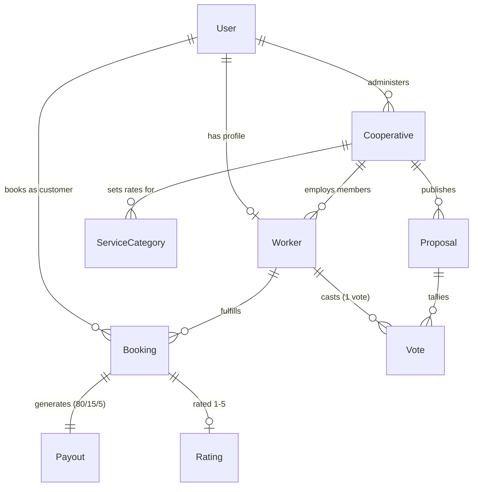

# 🏛️ SahakarConnect — System Architecture & Pitch Deck Reference
**Smart India Hackathon 2026 | Problem Statement 26089 | Ministry of Cooperation**

---

## 1. High-Level Architecture

```
                       +----------------------------------------------------+
                       |                  CLIENT LAYER                      |
                       |       React (Vite) + TailwindCSS + Recharts       |
                       |        i18next (English & हिन्दी Localization)     |
                       +-------------------------+--------------------------+
                                                 |
                                     REST APIs   |   WebSockets (Socket.io)
                                                 v
                       +----------------------------------------------------+
                       |                  SERVER LAYER                      |
                       |             Node.js + Express + TypeScript         |
                       |     - JWT Authentication (Phone OTP Simulation)    |
                       |     - AI Smart Match Engine (Weighted Scoring)     |
                       |     - Cooperative Payout Engine (80/15/5 Split)    |
                       |     - Democratic Governance Engine (1 Member 1 Vote)|
                       +-------------------------+--------------------------+
                                                 |
                                     Prisma ORM  |  SQL Queries
                                                 v
                       +----------------------------------------------------+
                       |                  DATABASE LAYER                    |
                       |              PostgreSQL 16 (Dockerized)            |
                       |   Users, Coops, Workers, Bookings, Payouts, Votes  |
                       +----------------------------------------------------+
```

---

## 2. Core Algorithmic Differentiators

### A. The 80 / 15 / 5 Payout Algorithm
Whenever a customer books and completes a gig service (e.g. ₹1,000 deep cleaning), the revenue is split atomically:

$$\text{Worker Share (80\%)} = \text{Amount} \times 0.80 = ₹800$$
$$\text{Cooperative Welfare Fund (15\%)} = \text{Amount} \times 0.15 = ₹150$$
$$\text{Platform Maintenance Fee (5\%)} = \text{Amount} \times 0.05 = ₹50$$

#### Why This Beats Corporate Aggregators (Urban Company/Uber):
1. **Aggregators take 20–30%**, distributing it entirely to private venture capital shareholders.
2. **SahakarConnect only keeps 5%** for basic server/infrastructure maintenance.
3. **The 15% cooperative share is NOT lost**: it is deposited directly into the registered cooperative's `fund_balance`. This reserve acts as the workers' self-funded insurance pool (accident insurance, equipment repair micro-loans, maternity aid, and professional skill upgradation).
4. **Total Worker-Controlled Wealth = 95%** (80% direct cash + 15% collective reserve).

---

### B. Smart AI Matching Engine (Weighted Multi-Factor Scoring)
When a customer searches for a service, candidates are ranked using the formula:

$$\text{Match Score} = (0.4 \times \text{Proximity}) + (0.3 \times \text{Rating}) + (0.2 \times \text{Availability}) + (0.1 \times \text{Skill Match})$$

- **Proximity Score (40%)**: Computed via Haversine distance from customer coordinates, normalized $\frac{1}{1 + (\text{Distance}_{\text{km}} / 8)}$. Closer workers receive higher priority, minimizing worker travel costs.
- **Rating Score (30%)**: Worker's cumulative $\frac{\text{Rating}_{\text{avg}}}{5.0}$ based on verified customer ratings.
- **Availability Score (20%)**: $1.0$ if the worker has toggled their duty status to Online, $0.2$ if offline.
- **Skill Match (10%)**: $1.0$ if the requested category is in the worker's certified skill tag set, $0.3$ otherwise.

*Transparency First*: Unlike black-box corporate ranking, customers and judges can click the "AI Smart Match Formula" button on any worker card to view the exact four-component calculation.

---

### C. Democratic One-Member-One-Vote Governance
Cooperative societies in India are fundamentally governed by the principle of economic democracy.

1. **Proposal Publishing**: Any Cooperative Admin can publish a proposal (e.g. *"Should we adjust plumbing rates by +₹50 to offset material inflation?"* or *"Allocate ₹50,000 from the welfare reserve for group accidental insurance"*).
2. **Ballot Constraint**: Enforced by database constraint `@@unique([proposal_id, worker_id])`. Each verified worker member of that cooperative can cast exactly **one vote**.
3. **Live Tallying & Resolution**: Real-time percentage breakdowns are dynamically computed and visible to all members. When the deadline passes or the admin closes the proposal, the winning option is officially enacted.

---

## 3. Database Entity Relationship (Prisma Schema Summary)



---

## 4. SIH Hackathon Pitch Deck Highlights

- **Problem**: 100M+ unorganized gig workers in India are burdened by high 20–30% platform cuts, lack of healthcare/pension safety nets, and no bargaining power.
- **Solution**: SahakarConnect digitally empowers primary worker cooperatives under the vision of **"Sahakar Se Samriddhi"** (Prosperity through Cooperation).
- **Social Impact**:
  - Puts **₹1,500 to ₹4,000 more per month** into the average household technician's pocket.
  - Generates self-sustaining cooperative welfare funds without relying on external charity.
  - Transparent government dashboard gives the Ministry real-time macro analytics of regional gig demand and cooperative performance.
